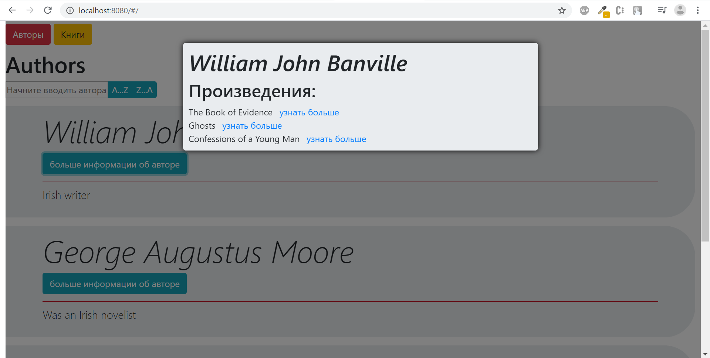
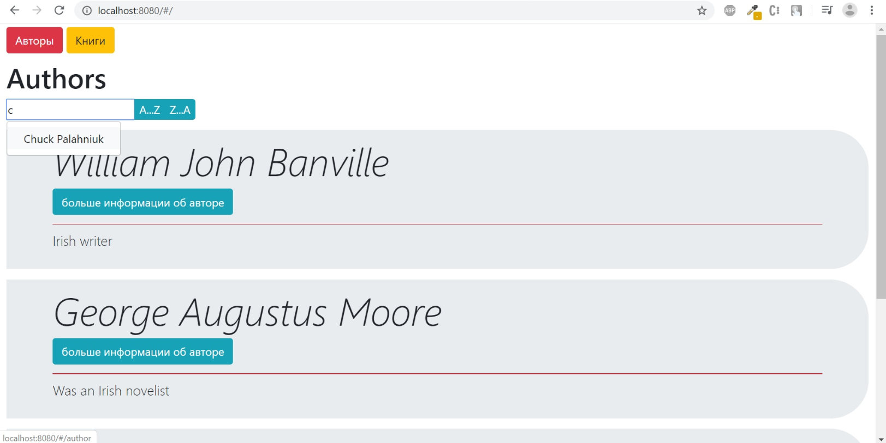
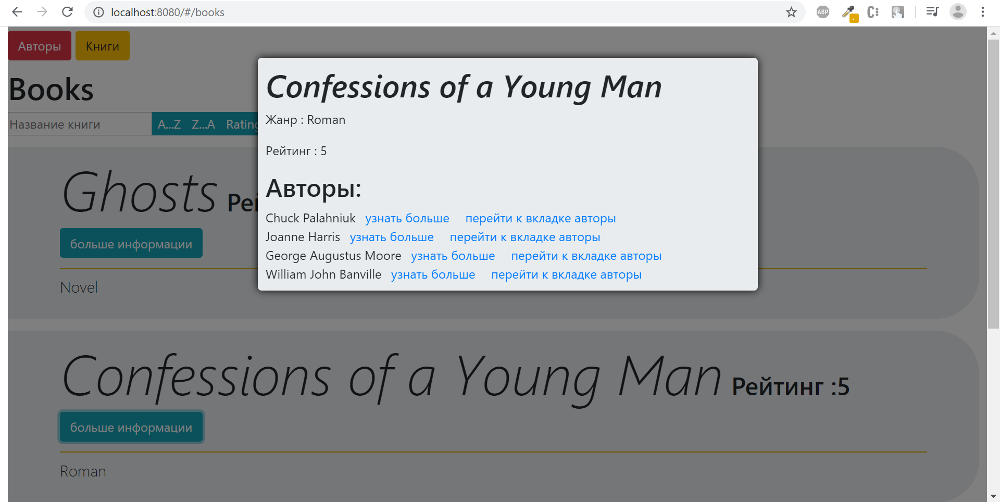

1 - либо через терминал , либо через pgAdmin 4 создать базу данных

2 - в файле src/server/src/config/config.js изменить в объекте development данные, для подключения к базе данных 

3 - в терминале проекта ввести 'npm run db' 

4 - в терминале проекта ввести 'npm start' 

5 - открыть http://localhost:8080/

Скриншоты не являются конечным видением проекта  

# Вкладка Авторы

# PopUp окно вкладки Авторы

# Карточка Автора

# Поисковая строка вкладки Авторы

# Внешне вкладка Авторы и вкладка Книги идентичны, функционально - вкладка Книги чуть более разнообразна согласно ТЗ

